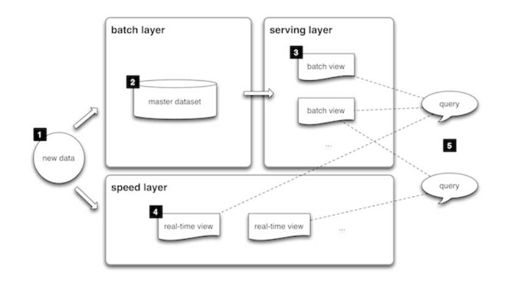

# Food ordering service

Educational project for a baccalaureate diploma

## Technologies used:

1. Kotlin 1.7 
2. Spring boot 3 (Java >= 17)
3. Postgres 15
4. ClickHouse
5. Apache Ignite
6. Kafka
7. Keycloak

## Architecture

The lambda architecture served as the basis of the project, 
since the purpose of this service is to maximize the processing speed of information coming from the IoT

The best in my opinion folder structure - hexagonal architecture mix with classical 3-layer architecture